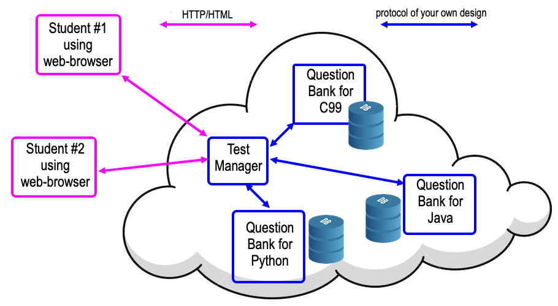

# Multi-Language Programming Test System

## Overview

This project develops a 3-tier network-based testing system which assesses students' proficiency in contemporary programming languages by presenting them with multiple-choice questions and short programming challenges.

This system comprises of three main components:

- A student interface, implemented as a web interface.
- A Test Manager (TM) application that manages student sessions and coordinates question delivery and grading.
- Question Bank (QB) applications that generate and assess questions.

Each of these components operates on a separate machine and communicates via standard network protocols.

## System Overview

Students interact with the system via a web browser. Upon authentication, the TM guides them through a series of questions and programming challenges, totaling marks for correct answers.

The TM communicates with the QBs, which generate a sequence of questions and programming challenges. The QBs also execute and grade the student's programming attempts.

## Features

1. Student Authentication: Pre-registered students must first login to the TM using a text-based name and password.

2. Question Navigation: Students can navigate through a sequence of questions, either multiple-choice or short programming challenges.

3. Marking Scheme: Marks are awarded based on attempts. Three marks for the first correct attempt, two for the second, and so on.

4. Performance Review: Students can view their marks to-date, or logout at any time.

## Setup

### Test Manager (TM)

- The TM is written in Java.
- It runs on a separate hardware from the QBs and the web browser client. 
- TM communicates with the web browser using HTTP and HTML. 
- Communication between the TM and the QBs is done via a custom protocol.

### Question Banks (QBs)

- Each QB is written in Python.
- They support the generation and marking of questions.
- The system runs two distinct QB instances, one for MCQ another for CQ.

## Constraints

- TM and QB software execute on different computers and would not access to any shared files.
- The system is developed for Linux, or macOS.
- The system can support multiple students simultaneously.
- The TM manages only testing and does not maintain question data or marking logic.
- The QBs do not handle student data and their marks.
- The TM provides a basic web-interface involving forms, a textarea, radio-buttons, and checkboxes.
- User/password management is only required for login and logout.
- User and password management is minimalistic, with pre-registered students and their unchangeable passwords stored in a file.
- The system does not require a sophisticated database - simple JSON files suffice for managing students, marks, and questions.

## Running the System

After setting up the environment correctly, navigate to the `tm` directory and run `make`. Then navigate to the `qb` directory and run `make`. This will start the TM and QB applications respectively.

Enter this in search bar of your chosen browser:

<http://127.0.0.1:2197/>